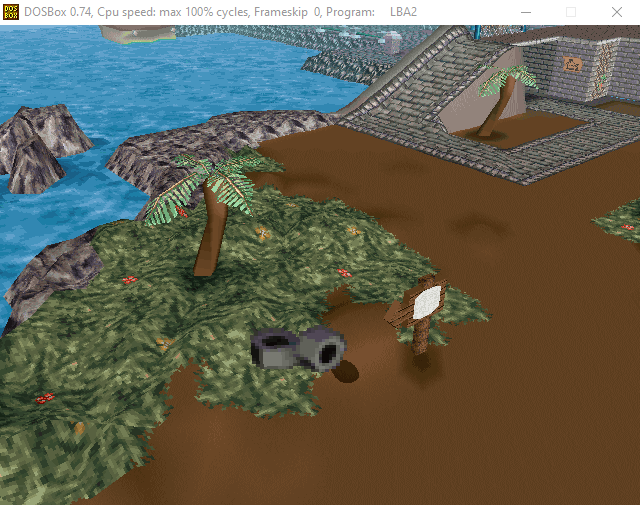
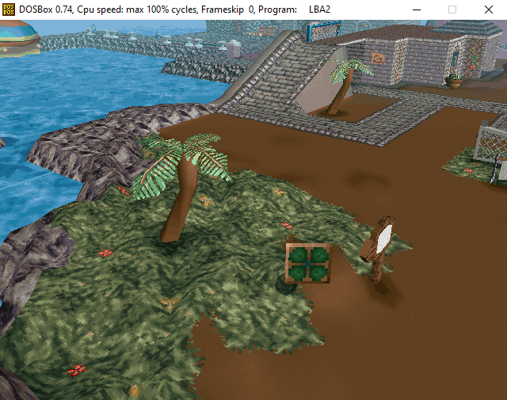
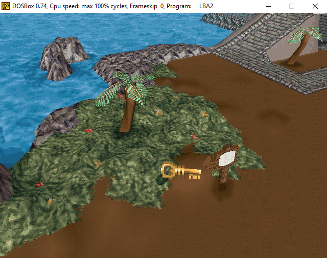

# LBA2: Sprite to Model
This is a program to convert LBA2 sprite files to LBA2 model files.

To extract the sprites from the Little Big Adventure 2 (Twinsen's Odyssey) game, use Zink's LBA Package Editor program from the https://www.magicball.net/ website. Here is the exact link: https://www.magicball.net/downloads/programs/development/lba_package_editor

Open an HQR file (High Quality Resource) - using Zink's program, and right-click on the desired entries to extract them to a location on your computer - preferably to the location of this C++ program. This program runs in a command prompt, so it will simply be easier to put the files in this folder. The converted model files will appear in the same folder, and will be ready to be replaced for any model from LBA2.

This has only been written, compiled, and tested on Windows 10 with Dev-C++ version 5.11. If you plan to port it to other operating systems in other languages, please do - just be sure to let me know. I don't know much about licensing, but all permission to port is welcome.

Some examples from using the above program:

